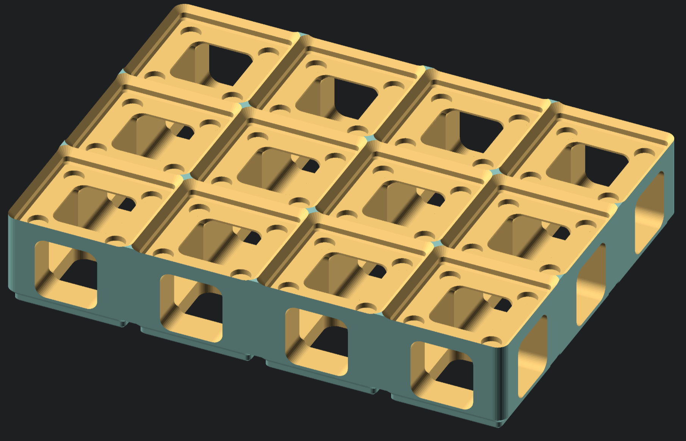
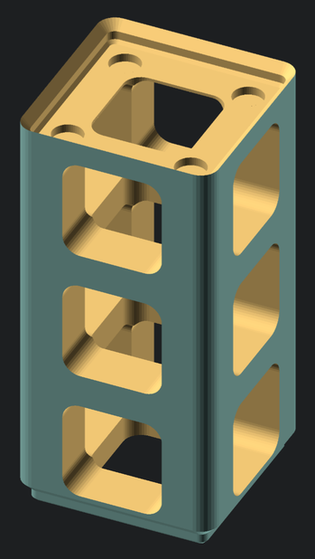
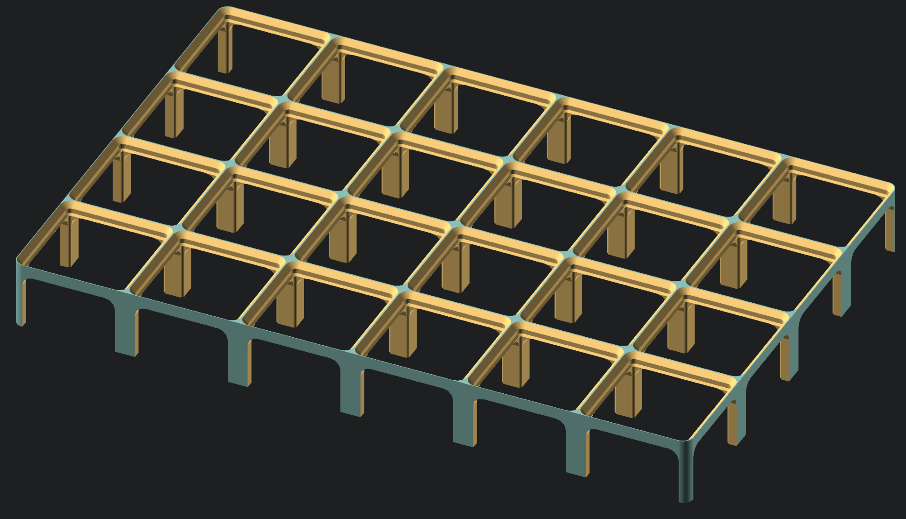

# Gridfinity Riser Modules

These are some riser modules useful for creating "cable basements" or otherwise
managing cable runs inside a gridfinity application.

Status:
- [x] working tunnel block for routing cables underneath a raised floor
- [x] tunnel towers can provide a sort of vertical conduit and/or support other
  modules; for example a AA battery charger stacked on top of a AA battery
  dispenser chute
  - [ ] experiment with / allow for non-square tunnels
- [ ] a baseplate variant of the tunnel block that is designed to sit well on a non-grid surface
  - maybe support edge pins to lock together multiple modules
  - maybe support cutting out voids for small devices embedded into the cable floor

## Tunnel Block

The primary module is a relatively solid/heavy block with tunnels cut along all 3 X/Y/Z axes for running cables.
The default tunnel size is 21mm (half of the gridfinity 42mm cell size), which embeds well in a 4u-tall block.

## Tunnel Tower

When a tunnel block is scaled large enough in the Z axis, there will be
multiple layers of X/Y oriented tunnels, forming a tower.

With the usual 21mm tunnel width, this works out to one tunnel every 4u
(with standard Gridfinity Z unit being 7mm).

## Raised Base

The initial design was a "legged table" based on [vector76] `frame_plain()` with extra height.

This version didn't feel great in practice,
as the legs would chatter/skip over the external surface,
allowing cables to jump/dislocate too easily.

[vector76]: https://github.com/vector76/gridfinity_openscad
